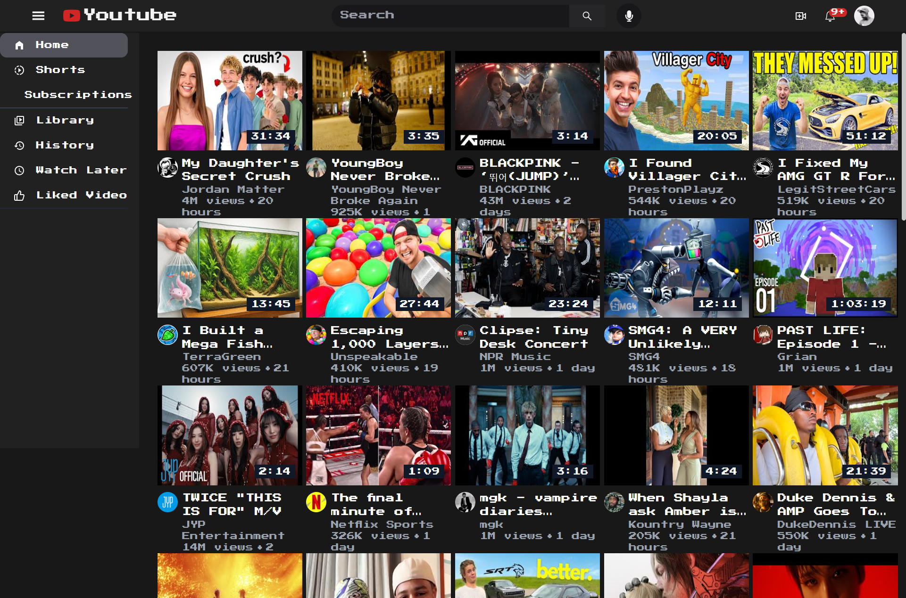

# YOUTUBE FRONTEND REPLICA



### 🌐 TRY IT LIVE  
👉 [Live on Vercel](https://youtubefrontendreplica.vercel.app/)  
Experience a modern replica of YouTube's web interface — visually and interactively!

## 📖 Overview

This project is a YouTube frontend replica built with JavaScript, HTML, and CSS. The goal is to closely mimic YouTube's core UI/UX as a learning exercise and portfolio showcase. The app recreates YouTube's design, layout, and user interactions, focusing on modern web technologies and best practices.

## ✨ Features

- **Homepage Feed**: Responsive grid layout with infinite scroll of video cards.
- **Video Player Page**: Embedded YouTube player loads selected video.
- **Navigation Sidebar**: UI sidebar with links to Home, Shorts, Subscriptions, Library, History, Watch Later, and Liked Videos (links are UI only, no actual routed pages).
- **Search Functionality**: Enter a search term in the navbar to fetch and display relevant video results.
- **Responsive Design**: Layout adapts for desktop and mobile using Tailwind CSS grid/flex utilities.
- **Video Thumbnails and Metadata**: Each card displays video title, duration, views, upload age, channel avatar, and channel name.
- **Loading Spinners**: Loader shown while videos or search results are being fetched.

## 🧰 Tech Stack

- **Frontend**: JavaScript (React), HTML, CSS, Tailwind CSS
- **Design/Styling**: Custom CSS, Flexbox, CSS Grid
- **Deployment**: Vercel

## 🔧 Installation & Setup

1. Clone the repository:
    ```bash
    git clone https://github.com/aridepai17/YOUTUBE-FRONTEND-REPLICA.git
    cd YOUTUBE-FRONTEND-REPLICA
    ```

2. Install dependencies and run locally:
    ```bash
    npm install
    npm start
    ```

## 📁 Project Structure

```
YOUTUBE-FRONTEND-REPLICA/
├── public/
│   ├── favicon.ico
│   ├── favicon.png
│   ├── index.html
│   ├── logo192.png
│   ├── logo512.png
│   └── manifest.json
├── src/
│   ├── assets/
│   ├── components/
│   │   ├── Card.js
│   │   ├── Navbar.js
│   │   ├── SearchCard.js
│   │   ├── Sidebar.js
│   │   └── Spinner.js
│   ├── features/
│   │   └── youtube/
│   │       └── youtubeSlice.js
│   ├── hooks/
│   │   └── useApp.js
│   ├── pages/
│   │   ├── Home.js
│   │   ├── Search.js
│   │   └── Watch.js
│   ├── store/
│   │   └── reducers/
│   │       ├── getHomePageVideos.js
│   │       ├── getRecommendedVideos.js
│   │       ├── getSearchPageVideos.js
│   │       └── getVideoDetails.js
│   ├── utils/
│   │   ├── convertRawtoString.js
│   │   ├── parseData.js
│   │   ├── parseRecommendendData.js
│   │   ├── parseVideoDuration.js
│   │   └── timeSince.js
│   ├── App.js
│   ├── index.js
│   └── index.css
├── .gitignore
├── final.png
├── package.json
├── postcss.config.js
├── tailwind.config.js
└── README.md
```

## 🧠 How It Works

1. **Homepage**: Renders a grid of video cards using YouTube API data.
2. **Searching**: Filters and displays videos based on user input.
3. **Video Playback**: Loads a video player with YouTube embed and details.
4. **Sidebar**: Displays UI navigation links.
5. **Responsive Layout**: Adapts to all screen sizes with CSS Grid/Flexbox.

## 📜 License

This project is open source and available under the [MIT License](LICENSE).

## 👨‍💻 Author

- **[aridepai17](https://github.com/aridepai17/)**

## 🙏 Acknowledgements

- Inspired by the real [YouTube](https://youtube.com) web interface
- [Vercel](https://vercel.com/) for fast deployment

---
*This project is a learning and portfolio showcase, not affiliated with or endorsed by YouTube or Google.*
